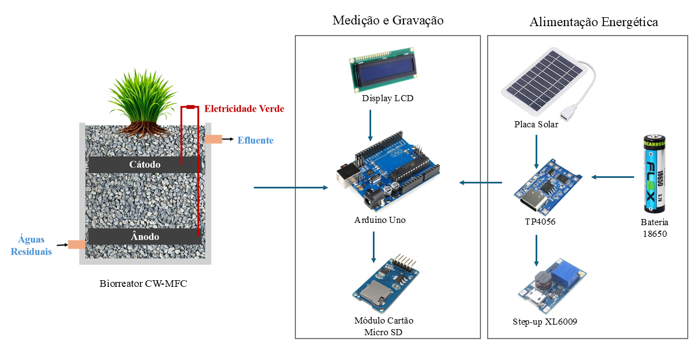

# Sistema de Monitoramento de Energia em Biorreatores CW-MFC



Este repositório contém os códigos-fonte e arquivos de suporte relacionados ao desenvolvimento de um sistema embarcado de baixo custo para **monitoramento de tensão e corrente elétrica em biorreatores do tipo Constructed Wetlands - Microbial Fuel Cell (CW-MFC)**, utilizando a plataforma Arduino.

O sistema foi desenvolvido como parte de um artigo técnico, com foco em eficiência energética, baixo custo e aplicabilidade em áreas com infraestrutura limitada.

---

## 📦 Estrutura do Repositório

```
monitoramento-biorreatores/
│
├── testes_iniciais/       # Testes individuais de cada módulo
│   ├── leitura_tensao_corrente.ino
│   ├── lcd_display.ino
│   └── modulo_sd.ino
│
├── codigo_final/          # Código integrado do sistema completo
│   └── sistema_monitoramento.ino
│
├── circuitos/             # Imagens e diagramas de circuitos utilizados
│   └── circuito_CW-MFC.png
│
├── README.md              # Este arquivo
├── LICENSE                # Licença do projeto (ex: MIT)
└── .gitignore             # Arquivos ignorados pelo Git
```

---

## 🔧 Tecnologias Utilizadas

- **Plataforma:** Arduino UNO
- **Módulos:** Display LCD 16x2 (I2C), Módulo SD Card, TP4056, Step-up 
- **Energia:** Bateria de íon-lítio recarregável + painel solar de 5W

---

## 📈 Funcionalidades

- Leitura periódica de **tensão e corrente** geradas por por três biorreatores CW-MFC
- Exibição das medições em tempo real em um **display LCD**
- Armazenamento dos dados em um **cartão SD** em formato `.txt`
  
---

## 🚀 Como Usar

1. Instale a **Arduino IDE (>= 1.8.19)**.
2. Clone este repositório:
   ```bash
   git clone https://github.com/Ana-Jackeline/energy_monitoring
   ```
3. Abra os arquivos `.ino` da pasta `/testes_iniciais` para verificar os módulos separadamente.
4. Use o código final da pasta `/codigo_final` para o sistema integrado.
5. Certifique-se de instalar as bibliotecas necessárias (ex: `LiquidCrystal_I2C.h`, `SD.h`).

---

## 📝 Licença

Este projeto está licenciado sob a [MIT License](LICENSE).

---

## ✍️ Autoria

Desenvolvido por **Ana Jackeline Alves da Silva**, com base em experimentos práticos conduzidos em 2025.  
